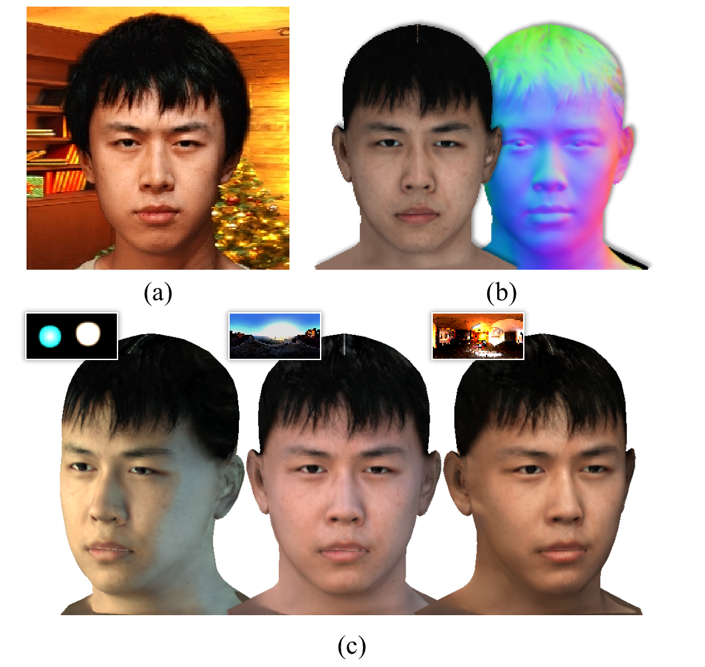

# Free-view Face Relighting using a Hybrid Parametric Neural Model on a SMALL-OLAT Dataset
## [Project page](https://miaoing.github.io/Free-view-Face-Relighting-using-a-Hybrid-Parametric-Neural-Model-on-a-SMALL-OLAT-Dataset/) |  [Paper](https://miaoing.github.io/Free-view-Face-Relighting-using-a-Hybrid-Parametric-Neural-Model-on-a-SMALL-OLAT-Dataset/)


This repository contains our implementation for the paper: [Free-view Face Relighting using a Hybrid Parametric Neural Model on a SMALL-OLAT Dataset](https://miaoing.github.io/Free-view-Face-Relighting-using-a-Hybrid-Parametric-Neural-Model-on-a-SMALL-OLAT-Dataset/). We present a hybrid parametric-neural relighting (PN-Relighting) technique. Taking a single portrait image as **input (a)**, we generate the **surface geometry and albedo (b)** and a **free-view 3D face relightable (c)** under different illumination.<br><br>

## Installation

#### Tested on Pytorch 1.11.0

Install environment:
```
conda create -n PNRelight python=3.8
conda activate PNRelight
conda install pytorch==1.11.0 torchvision==0.12.0 torchaudio==0.11.0 cudatoolkit=11.3 -c pytorch
pip install tqdm scikit-image opencv-python configargparse lpips imageio-ffmpeg Ninja tensorboard
```


## Run
This directory contains the code for running relighting module in our framework.

The sub-folders are:
* **networks**: Contains scripts for our networks mentioned in the paper
* **utils**: Contains utils in our implementation
* **eval**: Contains scripts for running our code and getting the outputs
* **test_data**:
	* images: Contains test images at 512px
	* masks: Contains masks at 512px, corresponding to the images
	* env: Contains environment map, corresponding to each image for relighting
* **checkpoints**: Folder to store checkpoints

In order to run our code, you have to download the necessary model checkpoints. We provide instructions to download checkpoints:
* Download the checkpoints for normal module, albedo module and relighting module.
Link: https://drive.google.com/file/d/1HWuxd9dNiJcd7UqlLOlwjQw_GB2E86K1/view?usp=sharing
* Place the files in the folder: checkpoints/ 

Finally, execute eval/normal_test.py to get surface geometry, eval/albedo_test.py to get albedo map and eval/relit_test.py to get relighting result. We provide examples below for you to try. We also provide eval/gen_demo.py that goes over all combinations and stores the outputs under test_data/relight.

You can use the following specifications:
* **python eval/gen_demo.py --folder=test_data**
  

## Citation
If you find our code or paper helps, please consider citing:
```

```
